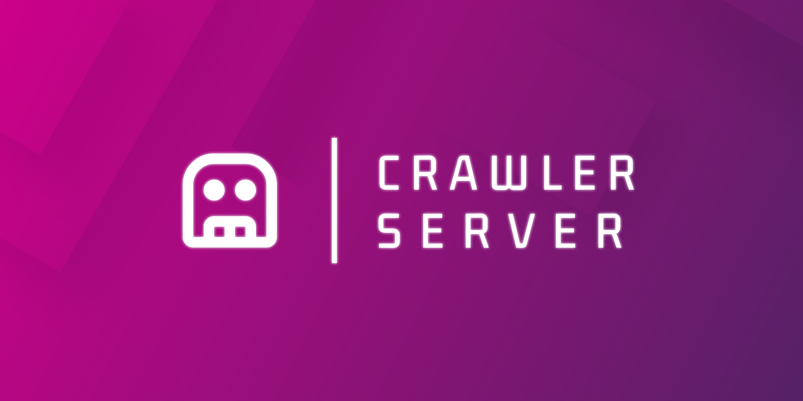

#  Liverpool | Crawler Server


Esta es la parte "servidor" del proyecto PLP Filler: https://github.com/SaulHernandezL/product-card-resolver para la extracción de datos de Liverpool y pintado de PLP Cards dentro de Figma.

## 🧐 Descripción

Utiliznado la tecnología de [Puppeteer](https://pptr.dev/) se ha creado un servidor en node que permite la extracción de datos de Liverpool y su posterior pintado dentro de Figma.

Todos los datos que se extraen se organizan en un JSON que se envia al cliente para que este pueda ser pintado dentro de Figma.

Las principales tecnologías usadas para este plugin son:

-  JavaScript: Como parte del lenguaje de programación para la creación de la extensión.
-  [Puppeteer:](https://pptr.dev/) Para la obtención de información directamente desde el productivo de Liverpool.
-  [Next.js:](https://nextjs.org/) Como framework para el seteo de servidor en node de forma rapida y sencilla.
-  [Node:](https://nodejs.org/en) Como servidor para la ejecución de la extensión.

En esta primera versión se han integrado funcionalidades tales como:

- 🔎 Búsqueda de PLP por SKU, tipo de producto o nombre de producto
- 📦 Extracción de datos de PLP
- ✅ Manejo de errores de extracción

Sinembargo futuras actualizaciones y mejoras de rendimiento se estarán realizando al proyecto.

## 👓 Para usar el proyecto

### Ver comentarios en el código

Para ver mejor la documentación se recomienda descargar la extensión Better Coments para poder visualizar los comentarios en el código de mejor manera.
Ingresa a better-comments y modifica el json de configuración de la siguiente manera:

```json

"workbench.iconTheme": "vscode-icons",
"workbench.productIconTheme": "el-vsc-v1-icons",
"better-comments.highlightPlainText": true,
"better-comments.tags": [
	{
		"tag": "!",
		"color": "white",
		"strikethrough": false,
		"underline": false,
		"backgroundColor": "#FF2D0040",
		"bold": false,
		"italic": false
	},
	{
		"tag": "?",
		"color": "white",
		"strikethrough": false,
		"underline": false,
		"backgroundColor": "#3498DB40",
		"bold": false,
		"italic": false
	},
	{
		"tag": "//",
		"color": "white",
		"strikethrough": true,
		"underline": false,
		"backgroundColor": "#47474740",
		"bold": false,
		"italic": false
	},
	{
		"tag": "todo",
		"color": "white",
		"strikethrough": false,
		"underline": false,
		"backgroundColor": "#FF8C0040",
		"bold": false,
		"italic": false
	},
	{
		"tag": "*",
		"color": "white",
		"strikethrough": false,
		"underline": false,
		"backgroundColor": "#98C37940",
		"bold": false,
		"italic": false
	},
	{
		"tag": "param",
		"color": "white",
		"strikethrough": false,
		"underline": false,
		"backgroundColor": "#0176ff40",
		"bold": false,
		"italic": false
	},
	{
		"tag": "main",
		"color": "white",
		"strikethrough": false,
		"underline": false,
		"backgroundColor": "#EF5DA840",
		"bold": false,
		"italic": false
	},
	{
		"tag": "funcion",
		"color": "white",
		"strikethrough": false,
		"underline": false,
		"backgroundColor": "#9f7dff40",
		"bold": false,
		"italic": false
	},
	{
		"tag": "import",
		"color": "white",
		"strikethrough": false,
		"underline": false,
		"backgroundColor": "#f4767740",
		"bold": false,
		"italic": false
	}
]

```